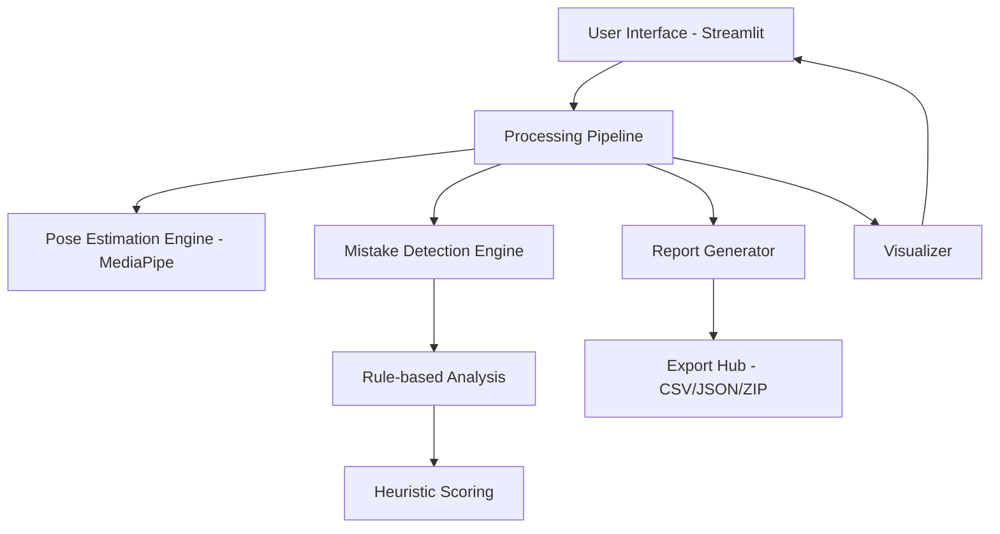
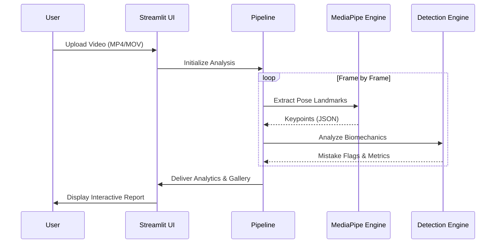

# 🏸 AeroPoint: Advanced AI Badminton Coach

AeroPoint is a cutting-edge computer vision system designed to provide professional-grade feedback for badminton players. By leveraging state-of-the-art pose estimation and biomechanical rules, AeroPoint detects technical mistakes in real-time and provides actionable insights to help athletes improve their game.

---

## 🌟 Key Features

- **🎯 AI Pose Estimation**: High-fidelity tracking of 33 body landmarks using MediaPipe.
- **🔍 Biomechanical Analysis**: Detection of specific technical flaws:
  - **Footwork**: Insufficient knee bend for stability.
  - **Smash Prep**: Incorrect elbow positioning and racket height.
  - **Swing Mechanics**: Real-time tracking of wrist speed and acceleration.
- **📊 Interactive Dashboard**: Visual analytics including mistake distribution, confidence scoring, and performance timelines.
- **🖼️ Visual Evidence Gallery**: Automated extraction of key frames where mistakes occurred for visual review.
- **💾 Comprehensive Exports**: Download results as professional CSV reports, JSON data, or a ZIP archive of visual evidence.
- **🚀 Modern UI**: Sleek, responsive Streamlit interface with dark mode support and intuitive workflow.

---

## 🏗️ System Architecture

AeroPoint follows a modular, pipeline-oriented architecture to ensure scalability and reliability.



---

## 🧠 How It Works

The system processes video data through several specialized layers to convert raw pixels into technical coaching advice.



---

## 🔄 Workflow Diagram

A typical user journey through the AeroPoint application:


---

## 🛠️ Installation

### Prerequisites
- Python 3.10 or higher
- Git

### Steps
1. **Clone the Repository**
   ```bash
   git clone https://github.com/thallamlikhith/AeroPoint.git
   cd AeroPoint
   ```

2. **Create Virtual Environment**
   ```bash
   python -m venv venv
   source venv/bin/activate  # On Windows: venv\Scripts\activate
   ```

3. **Install Dependencies**
   ```bash
   pip install -r requirements.txt
   ```

---

## ⚙️ Environment Setup

While AeroPoint works out of the box for local analysis, you can configure environment variables for extended functionality.

1. Create a `.env` file in the root directory:
   ```env
   # Example configuration
   OUTPUT_DIR=outputs
   CONFIDENCE_THRESHOLD=0.5
   ```

---

## 🚀 How to Run

Launch the AeroPoint dashboard using Streamlit:

```bash
streamlit run streamlit_app.py
```

The application will be available at `http://localhost:8501`.

---

## 📖 Example Usage

1. **Upload**: Drag and drop your badminton training video (side view recommended).
2. **Analyze**: Click "Start AI Analysis" to begin processing.
3. **Explore**:
   - Use the **Timeline View** to see exactly when mistakes occurred.
   - Check the **Analytics Dashboard** for high-level performance stats.
   - Review the **Image Gallery** to see your posture at the moment of error.
4. **Export**: Click "Download CSV Report" to save your results for later review.

---

## 💻 Tech Stack

- **Core**: Python 3.10
- **Computer Vision**: MediaPipe (Pose Landmark Detection), OpenCV
- **Web Framework**: Streamlit
- **Data Processing**: Pandas, NumPy
- **Visualizations**: Matplotlib
- **Packaging**: Zipfile, IO

---

## 👨‍💻 Author

**Likhith Thallam**  
*AI & Data Science Intern*  

---
<p align="center">Made with ❤️ for the Badminton Community</p>
